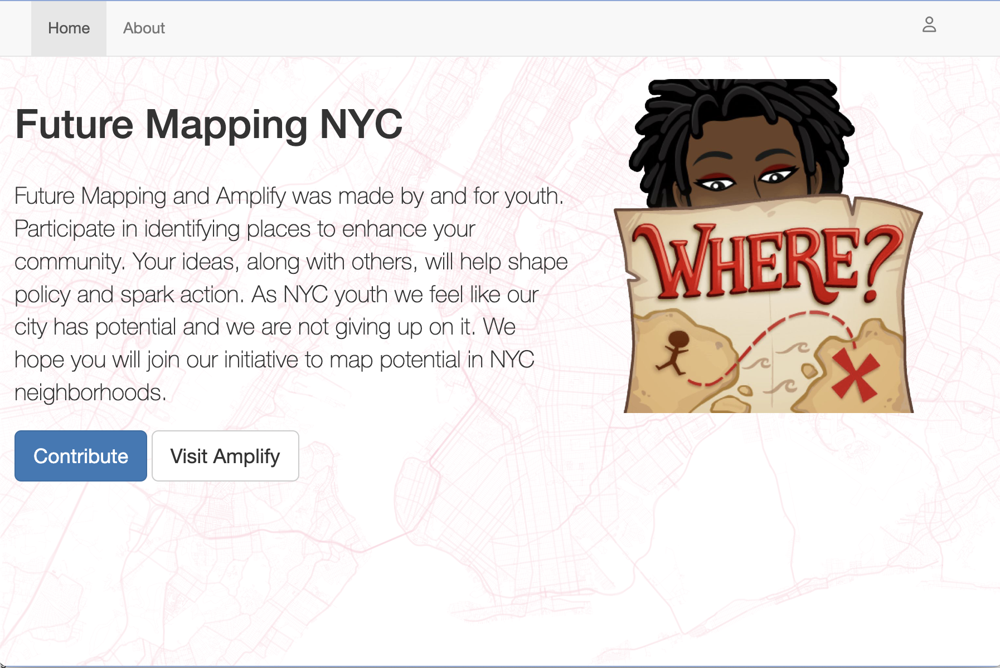
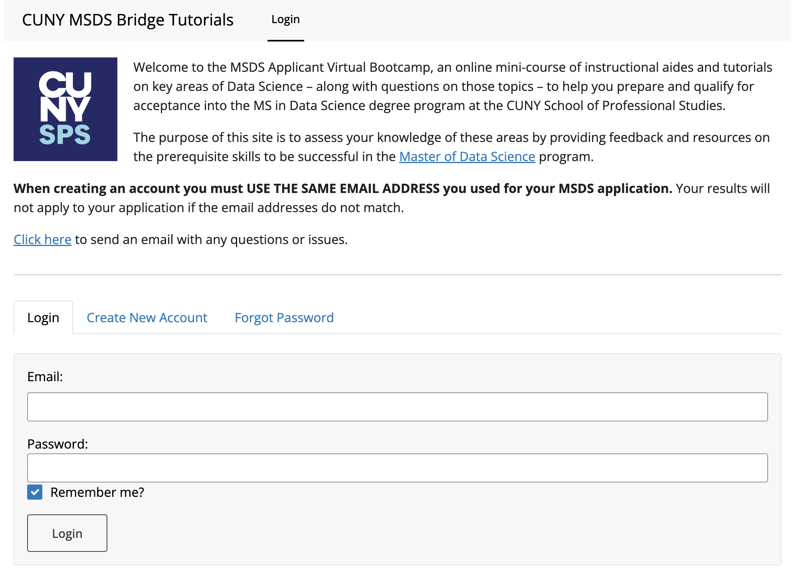
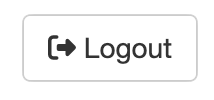
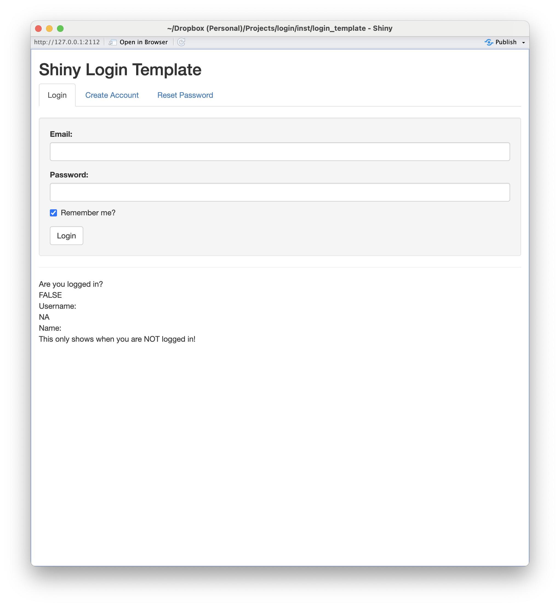
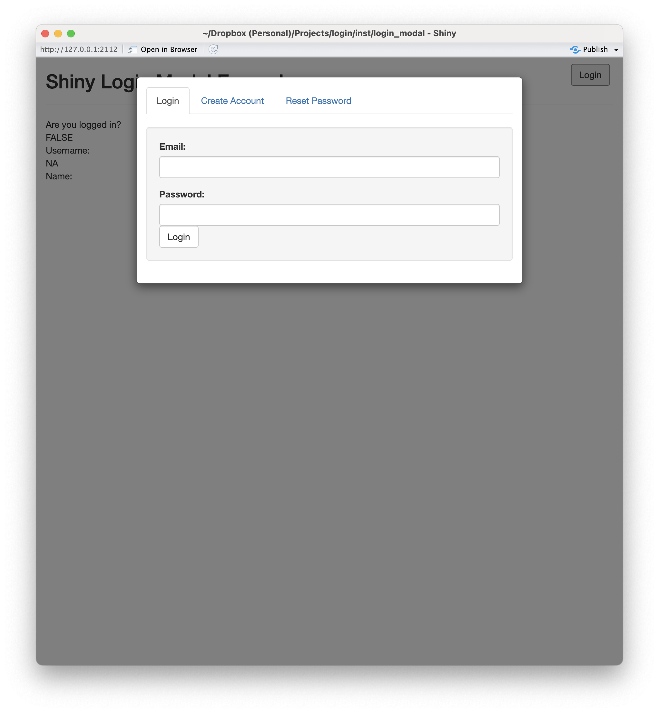

```{r setup, include=FALSE, results='hide', echo=FALSE, message=FALSE, warning=FALSE}
# options(width=70)
# options(digits=2)
# options(continue="   ")
# options(warn=-1)

library(ggplot2)
library(shiny)
library(login)
library(rmarkdown)

knitr::opts_chunk$set(digits = 3, width = 120,
					  warning = FALSE, message = FALSE, error = FALSE,
					  fig.width = 12, fig.height=6, fig.align = 'center',
					  digits = 3)

# The following is to fix a DT::datatable issue with Xaringan
# https://github.com/yihui/xaringan/issues/293
options(htmltools.dir.version = FALSE, htmltools.preserve.raw = FALSE)

# This style was adapted from Max Kuhn: https://github.com/rstudio-conf-2020/applied-ml
# And Rstudio::conf 2020: https://github.com/rstudio-conf-2020/slide-templates/tree/master/xaringan
# This slide deck shows a lot of the features of Xaringan: https://www.kirenz.com/slides/xaringan-demo-slides.html

# To use, add this to the slide title:   `r I(hexes(c("DATA606")))`
# It will use images in the images/hex_stickers directory (i.e. the filename is the parameter)
hexes <- function(x) {
	x <- rev(sort(x))
	markup <- function(pkg) glue::glue('')
	res <- purrr::map_chr(x, markup)
	paste0(res, collapse = "")
}

ggplot2::theme_set(theme_minimal())

```

class: center, middle, inverse, title-slide

<div style="float: right; width: 40%; top: -50px">
```{r, eval=TRUE, echo=FALSE, out.width='60%', fig.align='right'}

```
</div>

# `r metadata$title`
## `r metadata$subtitle`
### **`r metadata$author`**
### `r metadata$affiliation`
### `r metadata$date`


---
# Shiny authentication is not new...

* [`shinymanager`](https://datastorm-open.github.io/shinymanager/) - This is a great solution if you want to limit access to your entire Shiny application. This is accomplished by passing your UI (e.g. `fluidPage` object) to the `shinymanager::secure_app` function.

* [`shinyauthr`](https://paul.rbind.io/shinyauthr/) - This is another nice solution if you have a pre-existing database of users.

* [Posit Connect](https://posit.co/products/enterprise/connect/) - This is a paid product and allows you to protect your entire Shiny application outside of your application code.

* [Standard and Professional plans on shinyapps.io](https://docs.posit.co/shinyapps.io/authentication-and-user-management.html) - Similar to Posit Connect, this is a paid hosting service.


---
# Motivation for creating another this package

.pull-left[
[FutureMapping.org](https://futuremapping.org) is a project where young people in New York City can identify locations in their community that are assets, problems, or something else. 

```{r, echo=FALSE, out.width = '90%'}

```
]
.pull-right[
[Master of Data Science](https://sps.cuny.edu/academics/graduate/master-science-data-science-ms) (MSDS) at [CUNY School of Professional Studies](https://sps.cuny.edu/) Bridge Tutorials

```{r, echo=FALSE, out.width = '100%'}

```
]

Both these projects require user authentication, but the current authentication frameworks did not have all the features we needed...


---
# How is `login` different?

The `login` package provides some important features missing in the other Shiny authentication frameworks, namely:

* Users can create their own accounts. Optionally, you can require users to validate their email before creating the account.

* Users can reset their passwords via email.

* Allow user credentials to be stored in any [`DBI`](https://dbi.r-dbi.org) compatible database.

* Remember users by setting a cookie (this is optional both from the server and user point-of-view).

* Will log user activity for logging in and out.


---
class: font90
# Security

**Disclaimer:** I am not security researcher, but have attempted to implement the best practices to the best of my knowledge. If you have any suggestions feel free to open a [Github issue](https://github.com/jbryer/login/issues).

Here are some of the security features implemented by the `login` package:

* Passwords are encrypted client side (in the browser) using a [MD5](https://en.wikipedia.org/wiki/MD5) hash. There are a few advantages of doing this client side:
	* The password is never sent over the network in the clear. *You should still deploy your Shiny applications over https*. [Posit has instructions to do this](https://support.posit.co/hc/en-us/articles/213733868-Running-Shiny-Server-with-a-Proxy).
	
	* The Shiny server never sees the unencrypted password.

* Salt - Salting is the processes of encrypting the password a second time before storing the password in the database. To enable set the `salt` parameter of `login::login_server()`. Additionally, you can specify the encryption algorithm to use (defaults to `sha512` but any algorithm supported by `digest::digest()` is valid).
	

---
# Getting started

You can install the package from Github using the `remotes` package (should be on CRAN soon):

```{r, eval=FALSE}
remotes::install_github('jbryer/login')
```

There are three example Shiny applications included in the package:

* https://github.com/jbryer/login/blob/main/inst/login_demo_simple/app.R
* https://github.com/jbryer/login/blob/main/inst/login_template/app.R
* https://github.com/jbryer/login/blob/main/inst/login_modal/app.R

I recommend putting this at the top of your `app.R` or `global.R` file:

```{r, eval=FALSE}
library(login)
APP_ID <- 'my_login_app'
```


---
# Server Side

.pull-left[
```r
* USER <- login::login_server(
*  id = APP_ID,
  db_conn = RSQLite::dbConnect(RSQLite::SQLite(), 
    'users.sqlite'),
  users_table = "users",
  emailer = emayili_emailer(
    email_host = EMAIL_HOST,
    email_port = EMAIL_PORT,
    email_username = EMAIL_USERNAME,
    email_password = EMAIL_PASSWORD,
    from_email = RESET_PASSWORD_FROM_ADDRESS ),
  additional_fields = c('first_name' = 'First Name',
	                    'last_name' = 'Last Name'),
  cookie_name = "loginusername",
  cookie_expiration = 30,
  salt = 'mysupersecretsalt'
)
```
]
.pull-right[
The `login` package is implemented as a [Shiny module](https://shiny.posit.co/r/articles/improve/modules/). Within your server function you must call `login::login_server()`. The code on the left includes some of the basic features. The function will return a `reactiveValues` object with the following elements:
* `logged_in` - This is TRUE or FALSE.
* `username` - The username if they have successfully logged in (i.e. their email address).
]


---
# Defining database connection

.pull-left[
```r
USER <- login::login_server(
  id = APP_ID,
*  db_conn = RSQLite::dbConnect(RSQLite::SQLite(), 
*    'users.sqlite'),
*  users_table = "users",
  emailer = emayili_emailer(
    email_host = EMAIL_HOST,
    email_port = EMAIL_PORT,
    email_username = EMAIL_USERNAME,
    email_password = EMAIL_PASSWORD,
    from_email = RESET_PASSWORD_FROM_ADDRESS ),
  additional_fields = c('first_name' = 'First Name',
	                    'last_name' = 'Last Name'),
  cookie_name = "loginusername",
  cookie_expiration = 30,
  salt = 'mysupersecretsalt'
)
```
]
.pull-right[
All the `login` credentials are stored using the [`DBI`](https://dbi.r-dbi.org) interface. `DBI` currently supports RSQLite, RMariaDB, odbc, and bigrquery natively, but there is an [extensive list of other bakends](https://github.com/r-dbi/backends#readme) available.

The `users_table` parameter defines the table name in the database to store credentials. If the table doesn't exist, it will be created upon first run.
]


---
# Email

.pull-left[
```r
USER <- login::login_server(
  id = APP_ID,
  db_conn = RSQLite::dbConnect(RSQLite::SQLite(), 
    'users.sqlite'),
  users_table = "users",
*  emailer = emayili_emailer(
*    email_host = EMAIL_HOST,
*    email_port = EMAIL_PORT,
*    email_username = EMAIL_USERNAME,
*    email_password = EMAIL_PASSWORD,
*    from_email = RESET_PASSWORD_FROM_ADDRESS ),
  additional_fields = c('first_name' = 'First Name',
	                    'last_name' = 'Last Name'),
  cookie_name = "loginusername",
  cookie_expiration = 30,
  salt = 'mysupersecretsalt'
)
```
]
.pull-right[
An important feature of the `login` package is the ability to have users verify their email address when creating an account and for them to reset their passwords. The `emailer` parameter must define a function with three parameters: `to_email`, `subject`, and `message`. The package includes the `emayili_emailer()` function that uses the [`emayili`](https://datawookie.github.io/emayili/) package to send emails using SMTP. If you wish to implement your own emailer, use the following template:
```r
my_emailer <- function(to_email, subject, message) {
	# Implementation here
}
```
]


---
# Additional user information

.pull-left[
```r
USER <- login::login_server(
  id = APP_ID,
  db_conn = RSQLite::dbConnect(RSQLite::SQLite(), 
    'users.sqlite'),
  users_table = "users",
  emailer = emayili_emailer(
    email_host = EMAIL_HOST,
    email_port = EMAIL_PORT,
    email_username = EMAIL_USERNAME,
    email_password = EMAIL_PASSWORD,
    from_email = RESET_PASSWORD_FROM_ADDRESS ),
*  additional_fields = c('first_name' = 'First Name',
*	                    'last_name' = 'Last Name'),
  cookie_name = "loginusername",
  cookie_expiration = 30,
  salt = 'mysupersecretsalt'
)
```
]
.pull-right[
At a minimum, the `login` package will capture the users' email address and (encrypted) password. If you wish to capture more information when the user creates an account, you can specify the desired fields with the `additional_fields` parameter. This is a character vector where the names are the database field names and the values are the labels users will see when creating an account. Also, the values will be available in the returned `reactiveValues`, that is `USER$first_name` and `USER$last_name` will be set.
]


---
# Cookies

.pull-left[
```r
USER <- login::login_server(
  id = APP_ID,
  db_conn = RSQLite::dbConnect(RSQLite::SQLite(), 
    'users.sqlite'),
  users_table = "users",
  emailer = emayili_emailer(
    email_host = EMAIL_HOST,
    email_port = EMAIL_PORT,
    email_username = EMAIL_USERNAME,
    email_password = EMAIL_PASSWORD,
    from_email = RESET_PASSWORD_FROM_ADDRESS ),
  additional_fields = c('first_name' = 'First Name',
	                    'last_name' = 'Last Name'),
*  cookie_name = "loginusername",
*  cookie_expiration = 30,
  salt = 'mysupersecretsalt'
)
```
]
.pull-right[
If you wish to allow users login state to be saved between sessions, set the `cookie_name` parameter. This will be the name of the cookie stored in their browser. The `cookie_exppiration` is how long the cookie is valid in days. Set this parameter to `NULL` to disable cookies all together.

Note that if you have cookies enabled, users can still opt-out by unchecking the "remember me" check box.
]


---
# Salting

.pull-left[
```r
USER <- login::login_server(
  id = APP_ID,
  db_conn = RSQLite::dbConnect(RSQLite::SQLite(), 
    'users.sqlite'),
  users_table = "users",
  emailer = emayili_emailer(
    email_host = EMAIL_HOST,
    email_port = EMAIL_PORT,
    email_username = EMAIL_USERNAME,
    email_password = EMAIL_PASSWORD,
    from_email = RESET_PASSWORD_FROM_ADDRESS ),
  additional_fields = c('first_name' = 'First Name',
	                    'last_name' = 'Last Name'),
  cookie_name = "loginusername",
  cookie_expiration = 30,
*  salt = 'mysupersecretsalt'
)
```
]
.pull-right[
To enable salting, set the `salt` parameter. Additionally, you can use a different algorithm (sha512 is the default) using the `salt_algo` parameter. This parameter is passed to the `digest::digest()` function.
]

---
# There are even more options...

* `activity_table` the name of the table in the database to log login and logout activity.
* `reset_password_subject` the subject of password reset emails.
* `new_account_subject` the subject used for verifying new accounts.
* `verify_email` if true new accounts will need to verify their email address before the account is crated. This is done by sending a six digit code to the email address.
* `username_label` label used for text inputs of username.
* `password_label` label used for text inputs of password.
* `create_account_label` label for the create account button.
* `create_account_message` Email message sent to confirm email when creating a new account. Include `\%s` somewhere in the message to include the code.
* `reset_email_message` Email message sent to reset password. Include `\%s` somewhere in the message to include the code.
* `enclosing_panel` the Shiny element that contains all the UI elements. The default is `shiny::wellPanel()`. If you wish a more subtle appearance `htmltools::div()` is a reasonable choice.
* `code_length` the number of digits of codes emailed for creating accounts (if `verify_email == TRUE`) or resetting passwords.
* `shinybusy_position` Position of the spinner when sending emails. See [`shinybusy::use_busy_spinner()`](https://dreamrs.github.io/shinybusy/reference/manual-spinner.html) for more information.
* `shinybusy_spin` Style of the spinner when sending emails. See [`shinybusy::use_busy_spinner()`](https://dreamrs.github.io/shinybusy/reference/manual-spinner.html) for more information.


---
# Using the authentication state in the Shiny server

The `login::login_server()` returns a `reactiveValues` object. Therefore you can use the `USER$logged_in` within your Shiny server to change the behavior of the application based upon the users' login state. Since this is reactive, if the user logs out, the code will be re-executed.

```r
if(USER$logged_in) {
	username <- USER$username
	# The user is logged in, do something.
} else {
	# The user is not logged in.
}
```


---
# Shiny UI: Logging in and out

.pull-left[
There are a number of functions included to provide the user interface elements for logging in, logging out, resetting password, and creating an account. The `login_ui()` function provides an interface for the user to login. Similarly, the `logout_button()` provides a button for the user to logout. These interface elements will only display if the user is logged out or logged in, respectively.
]
.pull-right[
```r
login::login_ui(id = APP_ID)
```
```{r, echo=FALSE}
knitr::include_graphics('images/screenshot_login.png')
```

```r
logout_button(
  id = APP_ID,
  label = "Logout",
  icon = shiny::icon("right-from-bracket"))
```
```{r, echo=FALSE, out.width = '30%'}

```
]


---
# Shiny UI: Creating an account

.pull-left[
The `new_user_ui()` function will provide the fields necessary to create a new account. Note that there are additional text fields for the `additional_fields` parameter specified in the `login::login_server()` function earlier.

If the `verify_email = TRUE` in the `login::login_server()` then the user will be required to verify their email address before their account is created (and saved to the database). The interface is the same as steps 2 and 3 of the password reset process described on the next slide.
]
.pull-right[
```r
login::new_user_ui(id = APP_ID)
```
```{r, echo=FALSE}
knitr::include_graphics('images/screenshot_new_account.png')
```
]

---
# Shiny UI: Password reset

.pull-left[
The `reset_password_ui()` function provides an interface to reset passwords. It will display differently depending on what step the user is on.

**Step 1**: Enter email address. If the email address is in the database then they will proceed to step 2.
```{r, echo=FALSE}
knitr::include_graphics('images/screenshot_reset_password1.png')
```
]
.pull-right[
**Step 2**: Enter the code sent to the email address (the default is a random six digit code).
```{r, echo=FALSE}
knitr::include_graphics('images/screenshot_reset_password2.png')
```

**Step 3**: Enter a new password if the code in step 2 is entered correctly.
```{r, echo=FALSE}
knitr::include_graphics('images/screenshot_reset_password3.png')
```

]


---
# Adapting your UI to login state

There are two functions to assist with adapting your user interface based upon the users' authentication state: `is_logged_in()` and `is_not_logged_in()`. The `id` parameter is required, all other parameters are displayed or not depending on the user state.

```r
login::is_logged_in(
  id = APP_ID,
  div("This only shows when you are logged in!")
)
```

```r
login::is_not_logged_in(
  id = APP_ID,
  div("This only shows when you are NOT logged in!")
)
```


---
# Demos

.pull-left[

Simple template where the login UI is incorporated in your page.

```{r, eval=FALSE}
shiny::runApp(paste0(find.package('login'), 
					 '/login_template/'), port = 2112)
```
```{r, echo=FALSE, out.width = '70%'}

```

]
.pull-right[

Template where users login through a modal dialog.

```{r, eval=FALSE}
shiny::runApp(paste0(find.package('login'),
					 '/login_modal/'), port = 2112)
```
```{r, echo=FALSE, out.width = '70%'}

```

]

---
class: inverse, center, middle

# Questions?

---
class: inverse, left, middle

```{r login_qrcode, echo=FALSE, out.width='30%', out.height='30%', fig.width=3, fig.height=3, out.extra='style="float:right; padding:10px"; '}
qrcode::qr_code('https://jbryer.github.io/login') |> plot(col = c('#005DAC', 'white'))
```

.font300[Thank You!]  
[`r icons::fontawesome("envelope") |> icons::icon_style(fill = 'white')` jason.bryer@cuny.edu](mailto:jason.bryer@cuny.edu)  
[`r icons::fontawesome("github") |> icons::icon_style(fill = 'white')` @jbryer](https://github.com/jbryer)  
[`r icons::fontawesome('mastodon') |> icons::icon_style(fill = 'white')` @jbryer@vis.social](https://vis.social/@jbryer)  
[`r icons::fontawesome("link") |> icons::icon_style(fill = 'white')` jbryer.github.io/login/](https://jbryer.github.io/login/)   
[`r icons::fontawesome("linkedin") |> icons::icon_style(fill = 'white')` linkedin.com/in/jasonbryer/](https://www.linkedin.com/in/jasonbryer/)   
