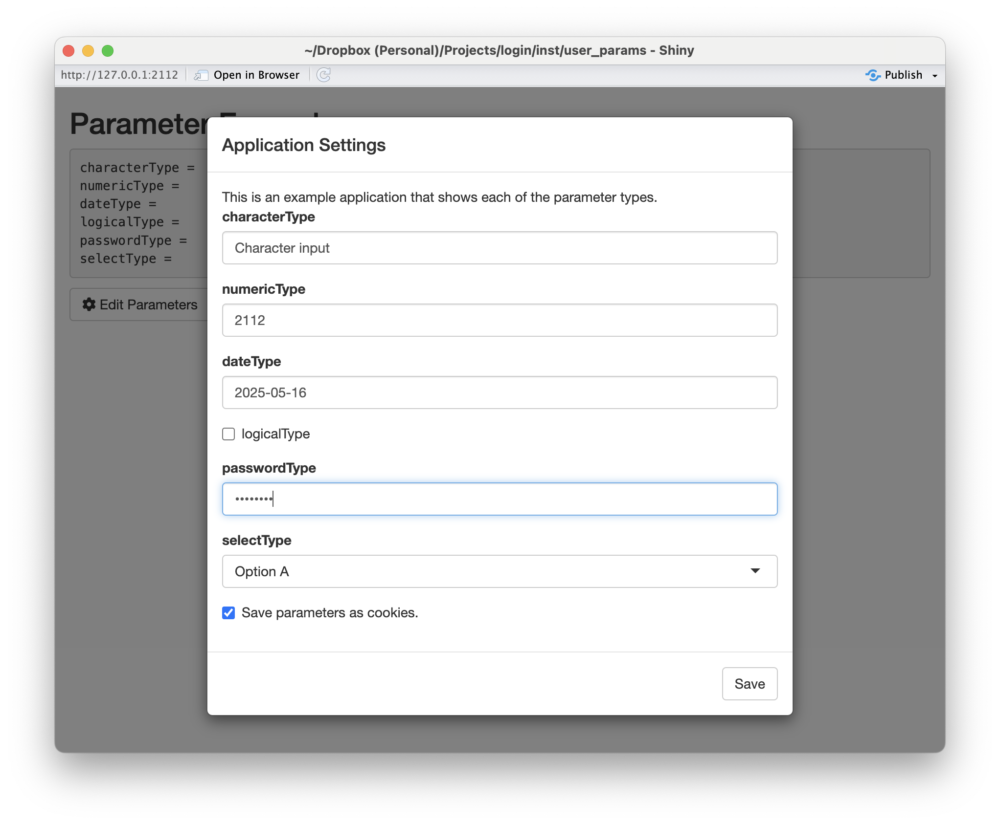
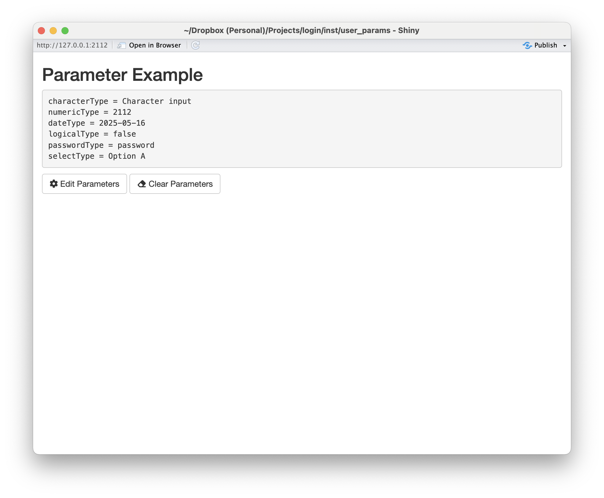

```{r, include = FALSE}
knitr::opts_chunk$set(
  collapse = TRUE,
  comment = "#>"
)
```

```{r setup, echo=FALSE}
library(login)
```

**tl;dr**

Once the `login` package is installed, you can run two demos using the following commands:

* `shiny::runApp(paste0(find.package('login'), '/user_params/'))`  
[https://github.com/jbryer/login/blob/main/inst/user_params/app.R](https://github.com/jbryer/login/blob/main/inst/user_params/app.R)

* `shiny::runApp(paste0(find.package('login'), '/data_viewer/'))`  
[https://github.com/jbryer/login/blob/main/inst/data_viewer/app.R](https://github.com/jbryer/login/blob/main/inst/data_viewer/app.R)

## Introduction

Shiny is an incredible tool for interactive data analysis. For the vast majority of Shiny applications I have developed I make a choice regarding the default state of the application, but provide plenty of options for the user to change and/or customize the analysis. However, there are situations where the application would be better if the user was required to input certain parameters. Conceptually I often think of Shiny applications as an interactive version of a function, a function with many parameters, some of which the user needs to define the default parameters. This vignette describes a Shiny module where a given set of parameters must be set before the user engages with the main Shiny application, and those settings can be optionally saved as cookies to be used across sessions. Even though this is the main motivation for this Shiny module, it can also be used as a framework for saving user preferences where saving state on the Shiny server is not possible (e.g. when deployed to [www.shinyapps.io](https://www.shinyapps.io)).

The user parameter module is part of the `login` R package. The goal is to present the user with a set of parameters in a modal dialog as the Shiny application loads. The primary interface is through the `userParamServer()` function that can be included in the server code. The following is a basic example.

```{r, eval=FALSE}
params <- userParamServer(
	id = 'example',
	params = c('name', 'email'),
	param_labels = c('Your Name:', 'Email Address:'),
	param_types = c('character', 'character'),
	intro_message = 'This is an example application that asks the user for two parameters.'),
	validator = my_validator
```

Like all [Shiny modules](https://mastering-shiny.org/scaling-modules.html), the `id` parameter is a unique identifier connected the server logic to the UI components. The `params` parameter is a character vector for the names of the parameters users need to input. These are the only two required parameters. By default all the parameters will assume to be characters using the `shiny::textInput()` function. However, the module supports multiple input types including:

* `date` - Date values
* `integer` - Integer values
* `numeric` - Numeric values
* `file` - File uploads (note the value will be the path to where the file is uploaded)
* `select` - Drop down selection. This type requires additional information vis-à-vis the `input_params` parameter discussed latter.

The above will present the user with a modal dialog immediately when the Shiny application starts up as depicted below.

```{r, echo=FALSE, fig.align='center', out.width='90%'}

```

The values can then be retrieved from the `params` object, which is depicted in the figure below.

```{r, echo=FALSE, fig.align='center', out.width='90%'}

```

The `userParamServer()` function returns a `shiny::reactiveValues()` object. As a result, any code that uses these values should automatically be updated if the values change.

There are two UI components, specifically the `showParamButton()` and `clearParamButton()` buttons. The former will display the modal dialog allowing the user to change the values. The latter will clear all the values set (including cookies if enabled).

## Cookies

It is possible to save the user's parameter values across session by saving them to cookies (as long as `allow_cookies = TRUE`). If the `allow_cookies` parameter is `TRUE`, the user can still opt to not save the values as cookies. It is recommend to set the `cookie_password` value so that the cookie values are encrypted. This feature uses the [cookies](https://cookies.shinyworks.org) R package and requires that `cookies::cookie_dependency()` is place somewhere in the Shiny UI.

## Full Shiny Demo

The figures above are from the Shiny application provided below.

```{r, eval=FALSE}
library(shiny)
library(login)
library(cookies)

#' Simple email validator.
#' @param x string to test.
#' @return TRUE if the string is a valid email address.
is_valid_email <- function(x) {
	grepl("\\<[A-Z0-9._%+-]+@[A-Z0-9.-]+\\.[A-Z]{2,}\\>", as.character(x), ignore.case=TRUE)
}

#' Custom validator function that also checks if the `email` field is a valid email address.
my_validator <- function(values, types) {
	spv <- simple_parameter_validator(values)
	if(!is.logical(spv)) {
		return(spv)
	} else {
		if(is_valid_email(values[['email']])) {
			return(TRUE)
		} else {
			return(paste0(values[['email']], ' is not a valid email address.'))
		}
	}
	return(TRUE)
}

ui <- shiny::fluidPage(
	cookies::cookie_dependency(),  # Necessary to save/get cookies
	shiny::titlePanel('Parameter Example'),
	shiny::verbatimTextOutput('param_values'),
	showParamButton('example'),
	clearParamButton('example')
)

server <- function(input, output) {
	params <- userParamServer(
		id = 'example',
		validator = my_validator,
		params = c('name', 'email'),
		param_labels = c('Your Name:', 'Email Address:'),
		param_types = c('character', 'character'),
		intro_message = 'This is an example application that asks the user for two parameters.')

	output$param_values <- shiny::renderText({
		txt <- character()
		for(i in names(params)) {
			txt <- paste0(txt, i, ' = ', params[[i]], '\n')
		}
		return(txt)
	})
}

shiny::shinyApp(ui = ui, server = server, options = list(port = 2112))
```

## Validation

The `validator` parameter speicies a validation function to ensure the parameters entered by the user are valid. The default value of `simple_parameter_validator()` simply ensures that values have been entered. The Shiny application above extends this by also checking to see if the email address appears to be valid. 

Validations functions must adhere to the following:

1. It must take two parameters: `values` which is a character vector the user has entered and `types` which is a character vector of the types described above.

2. Return `TRUE` if the validaiton passes OR a character string describing why the validation failed. This message will be displayed to the user.

If the validation function returns anything other than `TRUE` the modal dialog will be displayed. 

### Customizing the Shiny inputs

The `input_params` parameter allows for further customization of the various Shiny inputs. In particular, you can put any other `shiny::xxxInput` parameters into a list. For `select` input types the `choices` parameter is required. The following template provides the basic structure:

```{r, eval=FALSE}
input_params = list(PARAM1 = list(choices = c('Option A', 'Option B')), # When select is the type
					PARAM2 = list(min = 0, max = 10, stap = 1)) # When numeric or integer is the type
```

## File Input Example

The following Shiny application demonstrates how to use the file upload and drop down selection features.

```{r, eval=FALSE}
library(shiny)
library(login)
library(cookies)

#' Custom validator function that also checks if the `file` field is a valid CSV file.
my_validator <- function(values, types) {
	spv <- simple_parameter_validator(values)
	if(!is.logical(spv)) {
		return(spv)
	} else {
		if(!file.exists(values$file)) {
			return('File does not exists. Try uploading again.')
		} else if(!tools::file_ext(values$file) %in% c('csv', 'xslx')) {
			return('Only CSV and XLSX files supported.')
		}
	}
	return(TRUE)
}

ui <- shiny::fluidPage(
	cookies::cookie_dependency(),  # Necessary to save/get cookies
	shiny::titlePanel('Data Viewer'),
	showParamButton('csvviewer'),
	clearParamButton('csvviewer'),
	DT::DTOutput('data_table')
)

server <- function(input, output) {
	params <- userParamServer(
		id = 'csvviewer',
		validator = my_validator,
		params = c('filetype', 'file'),
		param_labels = c('File type', 'URL to a CSV file:'),
		input_params = list("filetype" = list("choices" = c("", "CSV" = "csv", "Excel" = "xlsx"))),
		param_types = c('select', 'file'),
		intro_message = 'This application will view a spreadsheet as a data table.')

	output$data_table <- DT::renderDT({
		df <- data.frame()
		if(file.exists(params$file)) {
			if(params$filetype == 'csv') {
				df <- read.csv(params$file)
			} else if(params$filetype == 'xlsx') {
				df <- readxl::read_excel(params$file)
			}
		}
		return(df)
	})
}

shiny::shinyApp(ui = ui, server = server, options = list(port = 2112))
```
